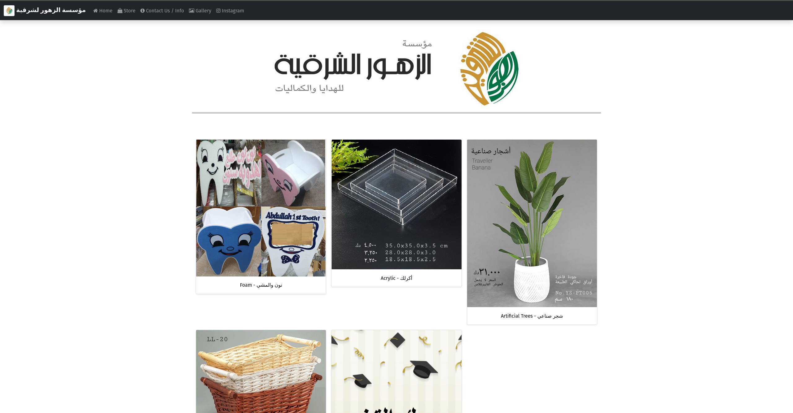
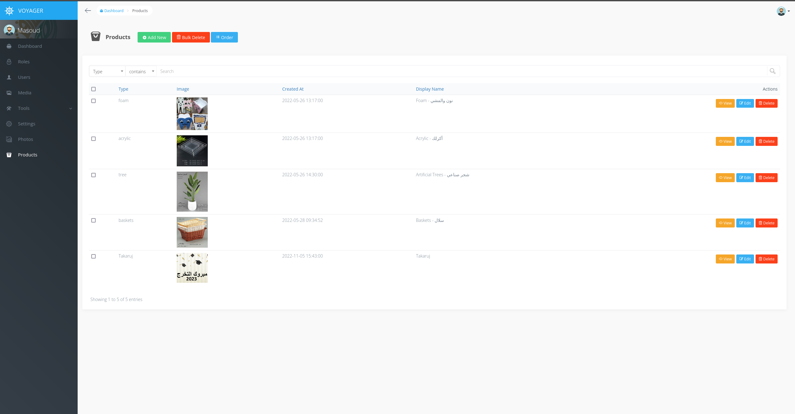
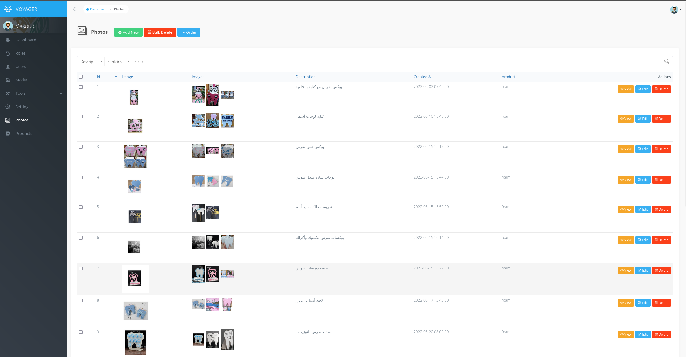

# Simple Laravel Gallery Website

 
## The Why

Most of the questions coming from customers were, "What products do you have", "Send me pictures of these products"
So instead of sending the same pictures over and over again, a link would be sent displaying the products that the customer asked for

Link Examples:

https://orekuwait.com/gallery

https://orekuwait.com/foam
 

## The How
Built With Laravel, uses MySQL for DB, The pages use Laravel Blade for simplicity as direct PHP code can be written on them, and has lots of helper functions that work well with Laravel
 

## The Extras

The app also has an easy-to-use admin panel powered by Laravel Voyager, It allows the easy addtion and modification of the website's galleries.

